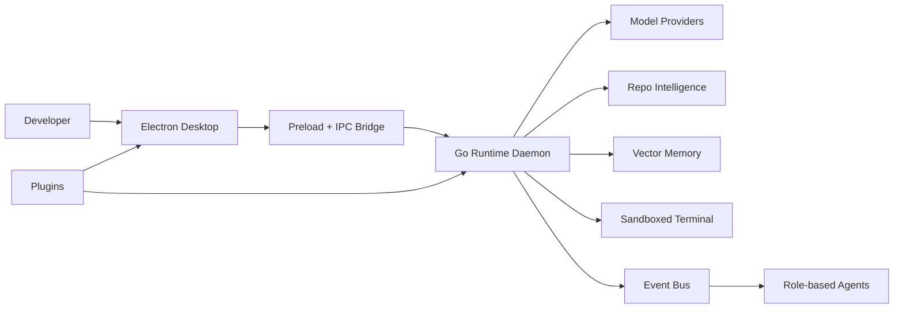
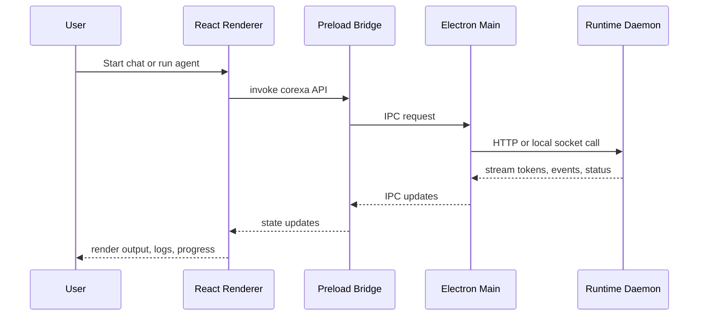
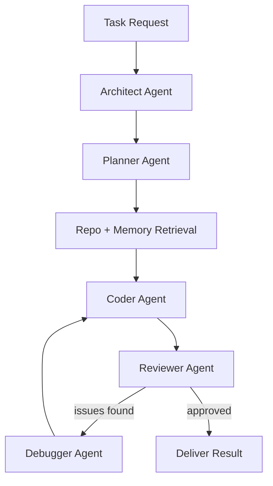
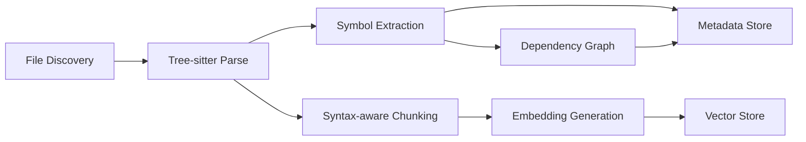
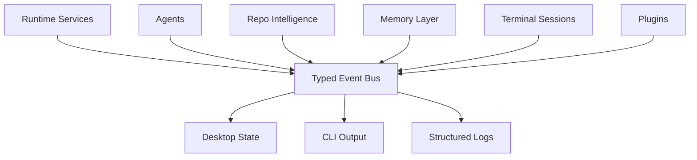

# Corexa Platform Architecture

Corexa is a local-first AI native development platform that merges an IDE-grade desktop experience with a local inference runtime, repository intelligence, semantic memory, terminal automation, and role-based engineering agents.

## 1. System Architecture

### Core Operating Model

Corexa works as a layered platform:

1. The Electron desktop app provides the AI-native user experience.
2. The Go runtime daemon manages model execution, terminal control, workspace services, and APIs.
3. TypeScript agent packages execute role-specific planning and software engineering logic.
4. Repository intelligence services scan, parse, chunk, and index the codebase.
5. Memory services persist embeddings, facts, and execution history in local vector storage.
6. Plugins extend workflows, panels, commands, tools, and future enterprise policies.



### Runtime Flow

```text
Desktop request
  -> IPC bridge
  -> runtime API call
  -> model routing / workspace lookup / memory retrieval
  -> agent or chat execution
  -> streamed events and tokens back to desktop
  -> UI updates, logs, artifacts, and follow-up actions
```

### Desktop Communication Flow



### API Layer

The runtime API should stabilize around these resource groups:

- `/v1/runtime/*` for health, configuration, and provider status
- `/v1/models/*` for discovery, pulling, loading, and routing
- `/v1/chat/*` for interactive assistant sessions and streaming
- `/v1/agents/*` for orchestration runs, plans, checkpoints, and resumptions
- `/v1/workspaces/*` for summary, policies, and settings
- `/v1/indexing/*` for repository scans, chunking, symbol extraction, and status
- `/v1/memory/*` for retrieval, memory writes, and collection introspection
- `/v1/terminal/*` for PTY session creation, streaming, and permissions
- `/v1/plugins/*` for plugin discovery, enablement, permissions, and sandbox state

## 2. Agent Architecture

Corexa uses role-specialized agents with a coordinator-driven handoff model.

### Agents

#### Planner Agent

- Translates goals into executable steps.
- Decides which files, tools, and validations are needed.
- Requests missing context from repo intelligence or memory before execution starts.

#### Coder Agent

- Applies code changes through editor abstractions, patching tools, or terminal actions.
- Generates implementation artifacts, migration steps, and test commands.
- Operates inside workspace and shell permissions enforced by policy.

#### Reviewer Agent

- Evaluates correctness, security, regression risk, and architecture drift.
- Produces structured findings, confidence signals, and residual risk notes.
- Acts as a quality gate before autonomous completion.

#### Debugger Agent

- Reproduces failures using terminal traces, logs, and prior run artifacts.
- Maps symptoms back to code, config, environment, or model selection issues.
- Produces minimal, test-backed remediations.

#### Architect Agent

- Owns system-level solution shape, decomposition, and dependency direction.
- Evaluates tradeoffs between UX, performance, modularity, and scalability.
- Guides when to use plugins, native modules, or runtime extensions.

### Communication Flow



### Task Execution Pipeline

1. Intake: normalize task goal, scope, workspace root, policies, and requested model.
2. Architectural framing: architect agent sets implementation constraints and system boundaries.
3. Planning: planner agent builds an execution graph with checkpoints.
4. Context assembly: repo intelligence and memory services fetch symbols, chunks, facts, and prior runs.
5. Implementation: coder agent edits code, runs commands, and generates artifacts.
6. Verification: reviewer validates behavior, tests, and architectural consistency.
7. Recovery: debugger engages only on failures or insufficient reviewer confidence.
8. Completion: results, artifacts, and memory writes are persisted for future reuse.

### Memory Access Model

- Planner and architect prefer higher-level summaries, dependency graphs, and prior solution patterns.
- Coder prefers code chunks, symbol neighborhoods, open-file context, and execution notes.
- Reviewer prefers diffs, test results, policy constraints, and architecture rules.
- Debugger prefers logs, error traces, dependency versions, and similar historical incidents.

### Repo Awareness

Repo awareness is not a prompt trick. It is a service contract:

- symbol graph lookup
- semantic chunk search
- import and dependency graph traversal
- workspace policy lookup
- git diff, branch, and modified-file awareness
- execution artifact correlation

## 3. Local AI Runtime Layer

The runtime layer is the control plane for local and future hybrid inference.

### Runtime Responsibilities

- provider abstraction
- model lifecycle management
- context window budgeting
- prompt assembly
- tool calling orchestration
- token streaming
- embedding generation
- concurrency control
- usage accounting

### Corexa Inference Engine

Initial production path:

- runtime provider adapter speaks the Corexa inference protocol
- model manager discovers local Corexa-compatible models and capability tags
- chat and embedding requests are normalized into Corexa request contracts
- responses stream back as NDJSON or SSE-style events
- provider health is surfaced to the desktop and CLI

### Inference Abstraction Layer

```text
Agent / Chat request
  -> inference facade
  -> provider router
  -> capability check
  -> prompt builder
  -> model execution
  -> stream normalizer
  -> post-processing and event emission
```

### Multi-provider Architecture

Core interfaces:

- `Provider`: execute chat, embeddings, tools, health, model listing
- `ModelRegistry`: catalog capabilities, local availability, fallback order
- `PromptAssembler`: construct system, repo, memory, and task context
- `StreamNormalizer`: unify provider-native streaming into platform events

### Future Backend Expansion

#### Embedded local engines

- Add adapters targeting in-process and server-backed local inference engines.
- Keep chat, embeddings, and tool execution behind the same `Provider` contract.
- Track quantization, memory pressure, and hardware fit in the model registry.

#### Hardware-aware acceleration

- Add platform-tuned backends for Apple Silicon, CUDA, and CPU-first environments.
- Route automatically when host hardware and selected model profile match.

#### Remote enterprise gateways

- Support secure remote inference endpoints behind the same provider interface.
- Keep remote execution opt-in, auditable, and policy-gated because Corexa is local-first by default.

### Model Manager

The model manager should track:

- installed models
- model capabilities
- provider ownership
- quantization and memory footprint
- local hardware compatibility
- preferred use cases such as planner, coder, embeddings, or review

## 4. Repository Intelligence System

Repository intelligence is a first-class subsystem, not a convenience feature.

### Responsibilities

- file discovery and filtering
- AST parsing with Tree-sitter
- symbol extraction
- dependency and import graph generation
- syntax-aware chunking
- embedding generation
- vector indexing
- semantic search
- incremental cache invalidation

### Indexing Pipeline



### Tree-sitter Integration

Tree-sitter is used for:

- incremental parsing after file changes
- extracting stable symbol boundaries
- understanding language-specific constructs
- linking chunks to symbols and import paths
- producing dependency graphs without brittle regex heuristics

### Chunking Strategy

Chunking should be syntax-first:

- prefer function, method, class, module, test block, or config object boundaries
- attach parent symbol path and nearby imports
- target 200 to 800 tokens per chunk depending on language density
- merge tiny nodes with semantic siblings to avoid fragmenting meaning
- store summary text alongside raw content for faster retrieval

### Embeddings and Indexing

- Code chunks are embedded separately from documentation and conversational memory.
- Symbol summaries receive their own embeddings to improve intent matching.
- Hot files and active diffs are re-embedded first to keep interactive workflows fast.

### Dependency Graph Generation

Graph layers:

- file-to-file import graph
- symbol-to-symbol reference graph
- package/module dependency graph
- test-to-source mapping
- workspace-to-service ownership graph for enterprise policy overlays

### Caching Strategy

Cache keys should include:

- workspace id
- file path
- file hash
- parser version
- embedding model id
- chunking policy version

Invalidate when any of those change.

## 5. Desktop Application Architecture

The desktop app is where Corexa becomes product, not just platform.

### Electron Structure

- `main/` manages windows, lifecycle, native menus, permissions, and runtime connectivity.
- `preload/` exposes a narrow, typed bridge into renderer-safe APIs.
- `renderer/` owns React UI, state, panels, and workspace interaction flows.

### React Renderer Architecture

Suggested feature modules:

- chat workspace
- agent run timeline
- workspace explorer
- model selector
- memory search
- settings and permissions
- terminal panel
- diagnostics and event stream

### IPC Communication

IPC should stay thin:

- renderer asks for capability
- preload validates and forwards
- main process brokers runtime or OS request
- runtime returns structured response or stream

Never expose unrestricted Node APIs directly to the renderer.

### Terminal Integration

- use `xterm.js` in renderer
- runtime daemon owns PTY creation and process control
- terminal sessions emit output events, exit codes, and approval requests
- session transcripts can be attached to agent runs and debugger flows

### AI Chat UI

The chat surface should support:

- freeform chat
- repository-aware ask mode
- agent-run mode
- tool activity timeline
- streaming token output
- expandable citations to files, chunks, commands, and memory hits

### Workspace Explorer

- standard file tree
- semantic views: symbols, hotspots, recent failures, active agent edits
- badges for indexed, stale, ignored, or policy-restricted files

### Model Selector

- grouped by provider
- capability badges: chat, code, embeddings, tools
- status: local, downloading, ready, incompatible
- per-surface default model assignment

### Settings System

Configuration scopes:

- global user settings
- machine settings
- workspace settings
- team policy overlays in future enterprise mode

## 6. CLI Design

The CLI is the automation and headless execution surface.

### Command Set

#### `corexa init`

- creates local workspace config
- initializes defaults for runtime, indexing, and policy
- optionally scaffolds plugin and agent settings

#### `corexa chat`

- launches a terminal-based local assistant session
- supports model selection, non-interactive prompts, and streaming output

#### `corexa run-agent`

- runs a specific role or orchestration workflow
- accepts task, workspace root, model overrides, and approval mode

#### `corexa models`

- lists installed and available provider models
- supports pull, inspect, warm, and remove subcommands later

#### `corexa scan`

- triggers repository discovery, parsing, embedding, and indexing
- supports incremental and full rebuild modes

### Command Structure

```text
corexa <resource> <action> [flags]

Examples:
corexa init my-workspace
corexa chat "summarize the current architecture"
corexa run-agent planner "design a migration plan"
corexa models
corexa scan .
```

## 7. SDK Architecture

The TypeScript SDK lets external tools and plugins use Corexa as a platform.

### SDK Modules

- runtime client
- streaming client
- chat APIs
- workspace APIs
- indexing APIs
- agent run APIs
- terminal APIs
- plugin registration APIs

### Streaming APIs

Streaming contracts should normalize:

- token deltas
- tool call start and completion
- retrieval citations
- approval prompts
- state transitions
- final artifacts

### Chat APIs

SDK chat should support:

- stateless prompts
- stateful sessions
- repo-aware context injection
- tool-enabled runs
- agent delegation

### Workspace APIs

- load summary
- index workspace
- query symbols
- fetch dependency graph
- retrieve memory and related chunks

## 8. Event System

Corexa should use an internal typed event bus to decouple the platform.

### Event Domains

- agent events
- workspace events
- model events
- runtime events
- terminal events
- plugin events
- indexing events
- memory events

### Event Topology



### Design Rules

- immutable event envelopes
- idempotent consumers where possible
- correlation ids for all agent and tool runs
- persisted event streams for replayable diagnostics
- event subscriptions scoped by workspace and session

## 9. Database and Memory Design

Corexa has two memory classes:

1. Operational metadata for workspaces, runs, and configuration.
2. Semantic/vector memory for chunks, facts, and prior outcomes.

### Vector Database Structure

Recommended collections:

- `workspace_chunks`
- `workspace_symbols`
- `conversation_memory`
- `workspace_facts`
- `agent_runs`

### Record Shape

Each vector record should store:

- id
- workspace id
- source path
- symbol path
- chunk type
- embedding model id
- content hash
- timestamps
- payload metadata
- optional human-readable summary

### Metadata Storage

Use a lightweight local relational or embedded store later for:

- workspace registrations
- file hashes
- index checkpoints
- model assignments
- settings
- plugin enablement
- run history headers

SQLite is a strong default for this layer even if vector data sits in Qdrant.

### Memory Retrieval System

Retrieval pipeline:

1. classify request type
2. pick collections and recall policy
3. embed query
4. retrieve top-k vector matches
5. rerank with recency, symbol proximity, and file relevance
6. compress results into agent-ready context blocks

### Semantic Memory

Corexa should remember:

- durable workspace facts
- user preferences
- successful fix patterns
- past architecture decisions
- prior failure signatures and resolutions

## 10. Security and Sandboxing

Security is central because Corexa can read repositories, run shells, and execute agents.

### Sandbox Model

- workspace-local by default
- explicit approval for writes outside workspace
- explicit approval for network access when policy requires
- explicit approval for destructive shell commands
- command allowlists and policy overlays

### Shell Restrictions

- route commands through a runtime policy engine
- classify read, write, network, and destructive actions
- log command intent, approval status, and output metadata
- attach session scope to agent and user identity

### Workspace Isolation

- each workspace gets isolated config, memory namespace, and event correlation
- plugin permissions are evaluated per workspace
- future enterprise mode can enforce policy bundles by repository classification

### Permission Domains

- filesystem read
- filesystem write
- terminal execution
- network access
- provider access
- plugin execution
- telemetry export

## 11. MVP Roadmap

### Phase 1: Local Intelligence Foundation

- Electron desktop shell with chat workspace
- Go runtime daemon with Corexa Runtime inference integration
- local model discovery and health
- repository scanning and Tree-sitter parsing baseline
- Qdrant-backed vector memory
- CLI commands for chat, scan, and models

### Phase 2: Autonomous Engineering

- planner, coder, reviewer, debugger, architect agents
- orchestration engine with checkpoints and approvals
- terminal session replay and policy prompts
- semantic memory write-back from completed tasks
- richer repo graph search and diff awareness

### Phase 3: Enterprise Platform

- plugin marketplace and policy-governed extensions
- cloud sync for settings and selected artifacts
- team memory spaces and approval workflows
- hybrid local and remote model routing
- observability, governance, and fleet management

## 12. GitHub Structure

### Repository Naming

- primary repository: `github.com/corexa/corexa`
- future split repositories if needed:
  - `corexa-docs`
  - `corexa-model-adapters`
  - `corexa-plugin-marketplace`

### README Structure

- product positioning
- architecture summary
- workspace map
- quick start
- docs links
- development standards

### Issue Templates

- bug report
- feature request
- later add security report and plugin proposal templates

### Pull Request Template

The PR template should ask for:

- problem and solution summary
- validation commands
- architecture and rollout risks

### Release Workflow

- use Changesets for workspace package versioning
- publish release notes from `main`
- build platform artifacts later per surface: desktop, CLI, runtime, native modules

## 13. Production Engineering Standards

### Logging

- structured JSON logging in runtime
- scoped logs for workspace, session, agent, command, and provider ids
- separate audit logs for permission and sandbox events

### Observability

- OpenTelemetry-ready traces across desktop, runtime, agents, and indexing
- metrics for token usage, latency, queue depth, index duration, and memory recall quality
- replayable event streams for debugging autonomous runs

### Testing Strategy

- unit tests for packages, agents, provider adapters, and chunking logic
- integration tests for runtime APIs, indexing, and memory retrieval
- fixture-based repository intelligence tests
- end-to-end desktop smoke tests
- golden tests for agent planning and reviewer outputs

### CI/CD

- Node, Go, and Rust verification in CI
- staged release workflows
- dependency vulnerability scanning
- branch protection on `main`

### Code Quality

- strict TypeScript
- clean architecture in Go runtime
- narrow IPC surface
- explicit contracts between agents and runtime
- ADRs for major architectural changes

### Linting and Formatting

- Biome for JS and TS
- `gofmt` and `go test`
- `cargo fmt` and `cargo test`

### Scalability Guidelines

- keep event bus and memory interfaces transport-agnostic
- isolate provider adapters by capability
- favor incremental indexing and streaming
- separate orchestration state from UI state

## 14. Future Vision

Corexa can evolve from a local AI coding product into a full AI operating layer for software development.

### AI Operating Layer

Corexa becomes the developer control plane for:

- local models
- repository cognition
- task execution
- terminal automation
- memory persistence
- AI-native workflows across desktop and CLI

### Autonomous Engineering Platform

Over time Corexa can support:

- long-running engineering workflows
- background monitors and maintenance agents
- repo-wide migrations
- policy-aware autonomous pull requests
- test triage and release assistance

### Enterprise AI Engineering Runtime

At enterprise scale, Corexa becomes:

- a secure local-first execution plane
- a governed agent runtime with auditability
- a hybrid inference router across local and enterprise models
- a system of record for engineering memory, workflows, and approvals

## 15. Recommended Near-term Build Sequence

1. Stabilize the Go runtime API surface and Corexa inference adapter.
2. Implement repository discovery, Tree-sitter parsing, and vector indexing.
3. Wire desktop chat, model selector, workspace explorer, and terminal pane.
4. Add planner, coder, reviewer, and debugger workflows with approval checkpoints.
5. Layer on richer memory recall, plugin runtime, and enterprise policy controls.
